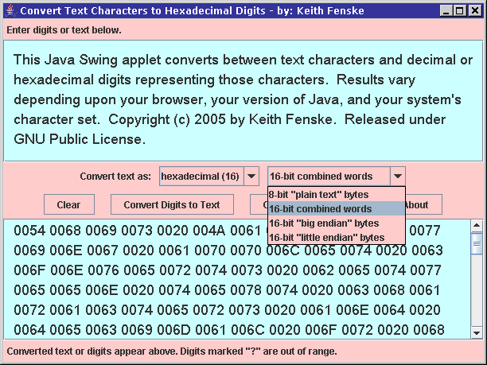

### Hex Text Applet (Java)

by: Keith Fenske, https://kwfenske.github.io/

HexText is an old Java 1.4 Swing (GUI) applet or application to convert between
text characters and decimal or hexadecimal digits representing those
characters. You have several options for the converted digits: decimal (base
10) or hexadecimal (base 16), 8-bit "plain text" bytes, 16-bit combined words,
16-bit "big endian" bytes, 16-bit "little endian" bytes, etc. Input characters
that are not valid digits are ignored during conversion and are treated as
white space or separators. Leading zeros may be omitted unless the digits run
together without separators. Type or paste the characters or digits to be
converted into the upper window, and click either the "Convert Text to Digits"
or the "Convert Digits to Text" button. The converted result will appear in the
lower window. There is a serious purpose behind these conversions, but it's
also fun just to see what some codes represent.

The program's comments and documentation reference web sites that no longer
exist, and discuss differences in Java versions that are now meaningless. No
changes will be considered. Web page applets are obsolete and may run as
stand-alone applications with the help of a wrapper (included). This becomes
less likely after Java 9 (2017).

Download the ZIP file here: https://kwfenske.github.io/hex-text-applet-java.zip

Released under the terms and conditions of the GNU General Public License,
version 3 or later (GPLv3+).

